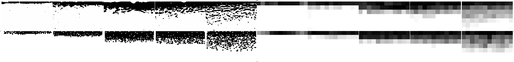
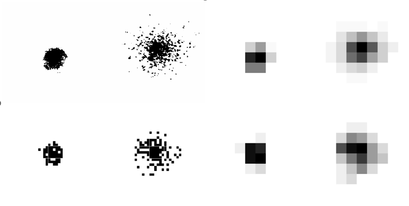

# Application of Approximate Bayesian Computation on lattice-based Individual Based Models of cancer invasion

 

In our previous work, we presented two different optimization schemes that estimate parameters for a Partial Differential Equation (PDE) model of cancer invasion based on synthetic spatial 1D data[^1]. Given the positive results with the spatial 1D dataset on variable densities, we now extend the study to spatial 2D datasets, which requires discretizing the PDE model in one more dimension within its numerical solver. We now focus on a spatial 2D individual-based model (IBM) that describes the micro-scale movements and allows us to study migration and invasion at the level of individual cells. Within this new modelling framework, the simulated patterns can be compared with cancer invasion patterns observed in in vitro or ex vivo assays, such as organotypic cultures, enabling us to draw parameter estimates on a more realistic basis. 

This repository contains all the simulation code and results of parameter optimizations on two different sets of invasion patterns recorded in organotypic cultures: the first describes the invasion of Squamous Cells Carcinoma (SCC) in an in vitro organotypic culture (mainly contains synthetic stroma composed of collagen gel embedded with fibroblasts) over 14 days [^2], whilst the second demonstrates the invasion of a T98G glioma spheroid in an ex vivo rat brain slices culture over a period of 3 days [^3].

[^1]: Xiao, Y., Thomas, L. & Chaplain, M. (2021), ‘Calibrating models of cancer invasion and metastasis: parameter inference using approximate Bayesian computation and gradient matching.’, R. Soc. Open Sci. 8(202237).
[^2]: Nystrom, S., Thomas, G., Stone, M., Mackenzie, I., Hart, I. & Marshall, J. (2005), ‘Development of a quantitative method to analyse tumour cell invasion in organotypic culture’, J. Pathol 205, 468–475.
[^3]: Matsumura, H., Ohnishi, T., Kanemura, Y., Maruno, M. & Yoshimine, T. (2000), ‘Quantitative analysis of glioma cell invasion by confocal laser scanning microscopy in a novel brain slice model’, Biochem. Biophys. Res. Commun. 269, 513–520.

## Results

### SCC Patterns

SCC cells invasion patterns observed in organotypic culture (Up) v.s. Simulated patterns from the numerical scheme (Down) at the end of day 3, 6, 9, 12, 14 (Grey shades density plot). The discrepancy of the 5 patterns was minimized one by one. Sum of squared differences between SCC cell density in observed patterns and final simulated patterns: 2.16.

### T98G Glioma Invasion Pattern

  

T98G glioma cells invasion patterns observed in organotypic culture (Up) v.s. Simulated patterns (grey shades plots) produced by the numerical scheme (Down). The scaling of the numerical domain was based on the realistic size of the glioma cells. Sum of squared differences between T98G glioma cell density in observed patterns and final simulated patterns: 1.22.

## Contents

- `Simulation results of SCC invasion (2nd experiment)/`  
  Code and simulation results of SCC invasion of the second experiment as described in the thesis.  
  Refer to [README.md](https://github.com/ycx12341/2D-sim-res/blob/main/Simulation%20results%20of%20SCC%20invasion%20(2nd%20experiment)/README.md)
- `Simulation results of SCC invasion (3rd experiment)/` 
  Code and simulation results of SCC invasion of the third experiment as described in the thesis. 
  Refer to [README.md](https://github.com/ycx12341/2D-sim-res/blob/main/Simulation%20results%20of%20SCC%20invasion%20(3rd%20experiment)/README.md)
- `Simulation results of T98G glioma spheroid invasion/` 
  Code and simulation results of T98G glioma spheroid invasion. 
  Refer to [README.md](https://github.com/ycx12341/2D-sim-res/blob/main/Simulation%20results%20of%20T98G%20glioma%20spheroid%20invasion/README.md)
- `Simulation SCC Day3 CPP/`  
  The post-day-3 simulation in the second experiment with SCC invasion patterns, implemented in C++. 
  Refer to [README.md](https://github.com/ycx12341/2D-sim-res/blob/main/Simulation%20SCC%20Day3%20CPP/README.md)

## Citation

***PUT DOI HERE AFTER THE PAPER PUBLISHED***
